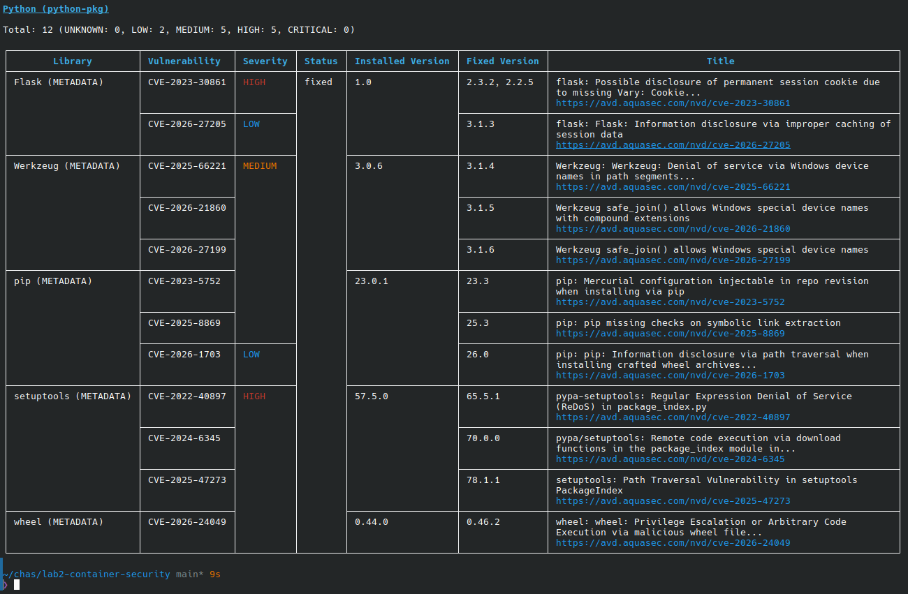
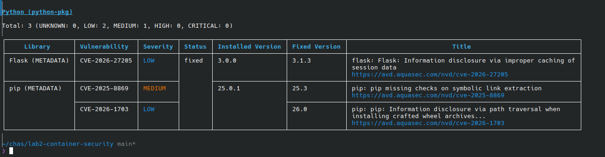
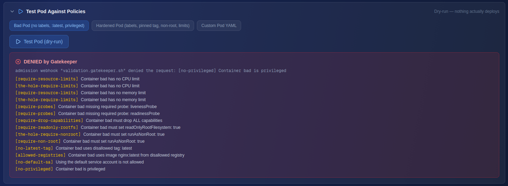
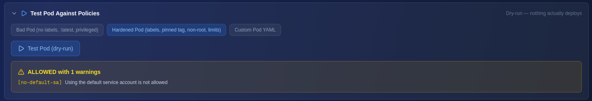

# LAB 2
## Container Security

[Screenshots](#screenshots)  
[Reflektion](#reflektion)  
[Vad jag har gjort](#vad-jag-har-gjort)  
[Verktyg](#verktyg)  

## Screenshots
Trivy Before

  

Trivy After

  

Gatekeeper Deny

  

Gatekeeper Pass

  

## Reflektion
En säker container är en mindre container. Istället för att köra en full Python kör man en slimmad version som har mycket mindre bloat. I scan-after.txt listas betydligt färre libraries än i scan-before.txt. Om ett library inte finns så behöver man inte oroa sig för att det är sårbart, eller härda just det. 
En SBOM visar vilka libraries som finns i projektet, och då är det lätt att se om man har ett library med kända sårbarheter. Man kan även tänka sig att det hjälper andra utvecklare när de ska patcha eller förnya projektet att se hur föregående gjorde.
Gatekeeper ser till att man inte deployar appar med säkerhetsrisker. Det kan vara saker som att man tillåter att appen kör som root, eller fel och sårbarheter som Kubernetes inte bryr sig om. 

## Vad jag har gjort
I den här labben har jag skannat en sårbar och en härdad Dockerfile med Trivy och jämfört resultaten. 
Därefter har jag genererat en SBOM (Software Bill Of Materials). även det med Trivy. 
Slutligt testade jag på Gatekeeper via Team Flags-interfacet. Där ser man att en dålig Pod är **väldigt** sårbar, medans en härdad Pod går igenom med kanske en varning.

## Verktyg
**För labben** 
* Trivy
* Docker
* Kubernetes
* Gatekeeper
* Github CLI  
**För dokumentationen**  
* fresh editor
* OnlyOffice
* Skärmklippverktyget i KDE Plasma